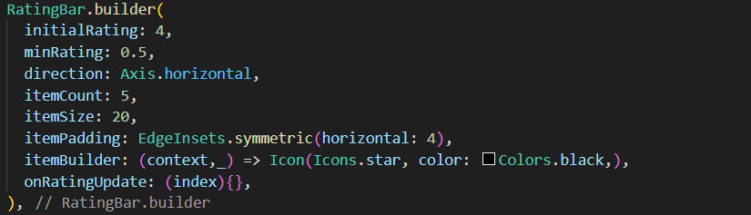

---
# **Codigo y descripción**
---

---
### - **RatingBar.builder(...)**: Este es un constructor personalizado que te permite crear un RatingBar.
### - **initialRating: 4**: Este le indica que la calificación inicial sera de 4 estrellas.
### -**minRating: 0.5**: Este define la calificación minima permitida en este caso es de 0.5, no se podra calificar por debajo de este valor
### - **direction: Axis.horizontal**: Este hace que el Rattingbar sea horizontal.
### -**itemCount: 5**: Este indica el numero de items o estrellas en total.
### -**itemSize: 20**: Este modifica el tamaño de las estrellas o items. 
### -**itemPadding: EdgeInsets.symmetric(horizontal: 4)**: Este agrega un espaciado horizontal de 4 píxeles entre cada estrella. 
### -**itemBuilder: (context, _) => Icon(Icons.star, color: Colors.black,)**: Aqui podemos especificar el dibujo como el icono o cambiar de color un item.
### -**onRatingUpdate: (index){}** Acá agregamos la logica en este caso el index sirve para que el usuario le de una nueva calificación.
