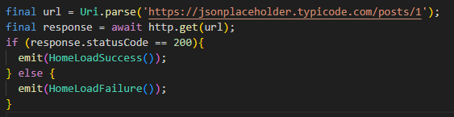

# explicacion de codigo

## Explicación
- se crea una variable url se usa la clase (Uri) y el metodo (parse) y se coloca la url
- se crea una variable response donde espera una respuesta http tipo get y la respuesta es asincrona no pasa a la otra linea de codigo si no hay respuesta
- despues se hace una condicion donde dice que si el estado es igual a "200" va a emitir el estado homeLoadSuccess
- y si no es "200" lo va a emitir a HomeLoadFailure