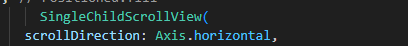

# Código y Descripción

## Captura de Pantalla

## Descripción del Código

- **Widget `SingleChildScrollView`**: En esta linea del codigo eso un widget llamado SingleChildScrollView que es un widget que me permite desplazar un child en una direccion especifica.
- **Propiedad `scrollDirection`**: Tambien uso scrollDirection que es una propiedad que ayuda a definir la direccion del desplazamiento y en este caso esta configurada como Axis.horizontal, lo que indica que el desplazamiento sera horinzontal.

En resumen, esta línea de código permite desplazar de forma horinzontal para mostrar todo el contenido.