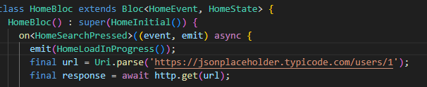

# Informe de App consulta

**Hecho por:** Said Márquez

## 1. Cómo diseñé la solución

Mi proyecto de flutter es una app en la cual el usuario o la
persona puede elegir a que candidato dar su voto, para esto
tendrá que accionar el botón que se encuentra ubicado debajo
de ellos (de su imagen) al hacerlo se mostrara una pantalla de
éxito donde su voto fue registrado o diligenciado de forma
correcta

## 2. Qué problemas encontré

Ahora basándonos en lo anterior suena muy sencillo, pero
si tuve algunas complicaciones y errores, uno de ellos fue este:

Tuve muchos problemas con el bloc, pero unos de los mas
destacables es que la pantalla de carga no me la contaba,
simplemente se saltaba hacia la pantalla de éxito o fallo, a lo
cual le pedí a chatgpt que me ayudara, y me mostro algo que
había pasado por alto y es que debía emitir primero el estado
carga antes de hacer la petición, por obvias razones ya que si la
petición cumplió con su tarea no necesita pantalla de carga, así
que la solución fue colocar el estado de cargando antes de la
petición.

## 3. Partes más difíciles

Sin duda alguna tiene partes complicadas, de las más
difíciles se destaca el bloc que no lo termino de comprender del
todo la sintaxis y la lógica que lleva, de por si con los estados y el
montón de import que lleva puede lograr enredar a pesar de
que este hecho para ser más fácil, sencillo y organizado, pero
eso no le quita su complejidad.

## 4. Herramientas usadas

Estas son las herramientas que utilicé para desarrollar mi proyecto:

- **Flutter**: Este es el framework por el cual se trabajó y permitió el
desarrollo de la app.
- **Dart**: Lenguaje de programación empleado por Flutter.
- **Bloc**: Usado para facilitar la organización y mantenimiento del código.
- **Visual Studio Code**: Editor de código donde se llevó a cabo todo el proceso de desarrollo.
- **Http**: Utilizado para realizar peticiones asíncronas.
- **ChatGPT**: Me ayudó a resolver algunos errores que no pude solucionar por mi cuenta.
- **Git y GitHub Desktop**: Herramientas adicionales empleadas en el proyecto.